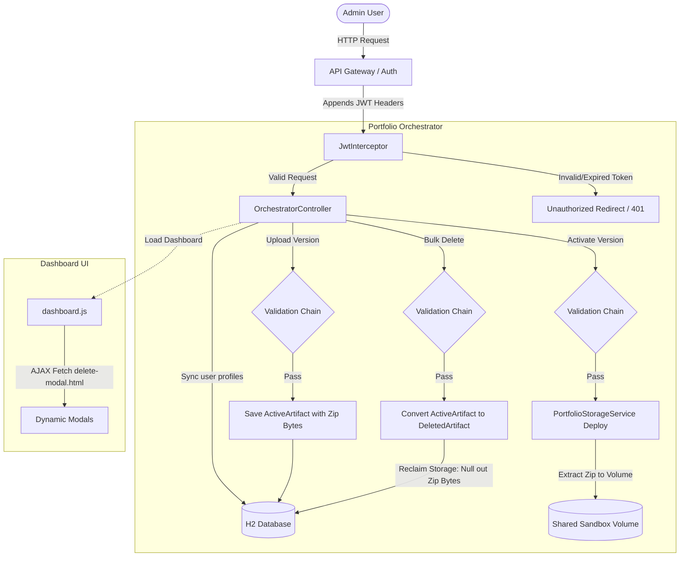
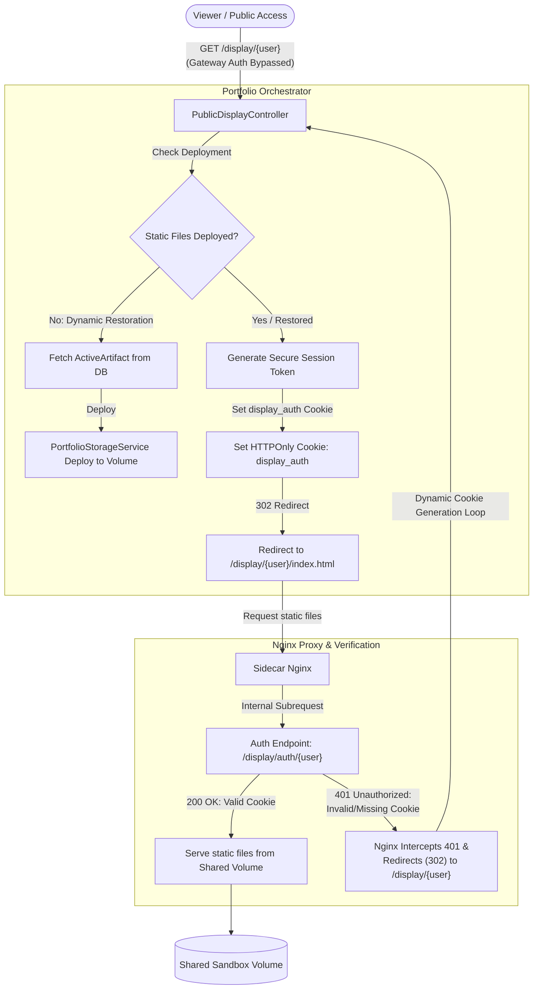

# Portfolio Orchestrator

A lightweight, high-performance modular microservice that orchestrates financial portfolio holdings and values, designed to deploy seamlessly in Kubernetes and Docker container environments.

---

## Architecture Overview

This repository is structured as a **multi-module Maven project** to maintain separate concerns and clean component isolation, mirroring the architecture of the `api-gateway` project:

1. **`app`**: The application parent wrapper module.
   - **`common`**: The **entry execution module** that compiles the main class, houses the configurations, and builds the final fat JAR.
   - **`orchestrator`**: A **library module** containing core controllers, DTOs, and business logic that `common` imports.
2. **`helm`**: The Kubernetes packaging module containing the Helm chart configurations.
3. **`docker`**: The Docker configuration module containing containerization files.

---

## Quick Start

### Prerequisites
- **Java 21** or higher
- **Maven 3.9+** (embedded wrapper provided)
- **Docker & Docker Compose** (for containerized runs)

### Local Build
To clean compile the codebase, run tests, and package the executable JAR, execute:
```bash
./mvnw clean install
```
The runnable Spring Boot fat JAR will be packaged in the entry module target folder:
`app/common/target/portfolio-orchestrator.jar`

### Running the Microservice
You can run the application directly using the Maven plugin from the root:
```bash
./mvnw -pl app/common spring-boot:run
```
Alternatively, execute the packaged JAR:
```bash
java -jar app/common/target/portfolio-orchestrator.jar
```

---

## Containerization (Docker)

To build and run the application locally inside Docker containers, follow these instructions:

### Build JAR & Run with Docker Compose
1. Clean package the Java application to build the target fat JAR:
   ```bash
   ./mvnw clean package
   ```
2. Launch the containerized service using Docker Compose:
   ```bash
   docker compose -f docker/docker-compose.yml up --build
   ```

### Manual Docker Build
If you prefer building the image manually from the repository root:
```bash
docker build -t jpg/portfolio-orchestrator:latest -f docker/Dockerfile .
docker run -d -p 8080:8080 --name portfolio-orchestrator jpg/portfolio-orchestrator:latest
```

---

## REST API Endpoints

Once the application is running, the endpoints are exposed on port `8080` (prefixed by the application context path `/app/portfolio`):

### Admin Management APIs
| HTTP Method | Path | Description |
|---|---|---|
| **GET** | `/admin` | Main dashboard router (redirects to administrative UI). |
| **GET** | `/admin/user` | Retrieves current user profile details, active and latest versions. |
| **GET** | `/admin/versions` | Retrieves the list of all uploaded/archived portfolio versions. |
| **POST** | `/admin/upload` | Uploads a new portfolio version (accepts multipart ZIP, major/minor flag, and optional tags). |
| **POST** | `/admin/active` | Switches the active portfolio version deployed in the sandbox environment. |
| **DELETE** | `/admin/versions` | Bulk processes the deletion of selected versions, converting them to metadata-only records. |
| **GET** | `/admin/download/{version}` | Downloads the original ZIP payload for a specific active portfolio version. |

### Public & Sandbox Display APIs
| HTTP Method | Path | Description |
|---|---|---|
| **GET** | `/display/{user}` | Renders the active portfolio site, dynamically restoring static files from DB storage to sidecar volumes if missing. |
| **GET** | `/display/auth/{user}` | Validates the user's display session token against the active display authorization session. |

### Platform Metrics & Health
| HTTP Method | Path | Description |
|---|---|---|
| **GET** | `/actuator/health` | Overall microservice system health status. |
| **GET** | `/actuator/health/liveness` | Kubernetes/Docker Liveness Probe endpoint. |
| **GET** | `/actuator/health/readiness` | Kubernetes/Docker Readiness Probe endpoint. |
---

## System Process Workflows

### 1. Administrative Workflow
This workflow illustrates how administrative requests (dashboard access, file uploads, activations, downloads, and bulk deletions) propagate from the user through the security layers and validation chains to persistence and sandbox storage.



### 2. Public Display Workflow
This workflow illustrates how public viewer requests bypass API Gateway authentication to access sandbox portfolio assets. It highlights the dynamic self-healing deployment check, cookie token generation, and sidecar Nginx intercepting invalid/missing session states (returning 401) to redirect the user back to the dynamic entrypoint to establish authentication.



---

## Kubernetes Deployment (Helm)

To deploy the **Portfolio Orchestrator** inside a Kubernetes cluster, configure the target namespace and run:

```bash
helm upgrade --install portfolio-orchestrator ./helm/portfolio-orchestrator \
  --namespace default \
  --values ./helm/portfolio-orchestrator/values.yaml
```

### Configurable Deployment Values
Review and update `helm/portfolio-orchestrator/values.yaml` to configure:
- **`replicaCount`**: Number of running pod instances.
- **`image`**: Repository, tag, and pullPolicy details.
- **`resources`**: Memory/CPU requests and limits.
- **`ingress`**: Domain hosts and SSL routing policies.

---

## Core Architecture & Design Decisions

### 1. Self-Registering Validation Chain
To ensure premium application security and clean coding practices, we employ a custom validation framework:
- **Decoupled Architecture**: Individual validation rules (e.g., `ZipBombValidation`, `StaticFileOnlyValidation`) are implemented as self-contained Spring `@Component` beans.
- **Self-Registration**: The central `ValidationChain` automatically autowires all available `ValidationStep` beans in the Spring context.
- **Ordered Execution**: The beans declare their priority order using Spring's standard `@Order` annotation (e.g., executing critical Zip Bomb validation first).
- **Dynamic Scoping**: Each bean specifies which scenario (`UPLOAD`, `ACTIVATE`, `DELETE`) it applies to via a `supports(ValidationScenario)` method, allowing the chain to filter and execute the correct steps on the fly.
- **Architectural Implications**: Leveraging the `supports()` mechanism in the chain provides an extensible approach requiring zero manual bean mapping or factory wiring. In the future, we can migrate to a dynamic `ValidationChainFactory` to build custom chains at runtime without modifying individual steps.

### 2. Polymorphic Storage & Version Archival
To conserve system resources and database storage without losing historic telemetry, we utilize a polymorphic schema:
- **Active Artifacts (`ActiveArtifact`)**: Retain full binary assets (`byte[]` data) representing the deployed or downloadable version of the portfolio.
- **Archived/Deleted Artifacts (`DeletedArtifact`)**: When a user deletes a version, the system removes the binary payload to reclaim database storage space. However, it preserves metadata (e.g., version strings, tags, and timestamps) in a polymorphic copy.
- **Entity State Transition**: The bulk delete service drops the `ActiveArtifact` and inserts a `DeletedArtifact` copy in a single transactional step, maintaining references in the user profile while preventing future downloads or redeployments of that version.

### 3. Asynchronous Lazy-Loaded UI Components
To keep the administrative interface lightweight and ensure premium visual responsiveness, we decoupled major modal cards from the primary document context:
- **On-Demand Template Fetching**: UI overlays (such as the new `delete-modal.html`) are isolated as static fragments. They are fetched asynchronously via the Fetch API only when the user triggers the action.
- **DOM Footprint Reduction**: By avoiding heavy, pre-rendered modal markup inside `index.html`, the browser initial paint times remain extremely low.
- **Micro-Animations & Visual Staging**: Slide-in transitions and color-coded status badges (`Pending` ➔ `Deleting` ➔ `Success` / `Failed`) are updated reactively on the UI as each resource is processed by the batch deletion pipeline.

### 4. Dynamic Sandbox Volume Restoration (Resilience)
The platform features automatic self-healing capabilities for the public-facing static display sandbox:
- **Stateless Volume Verification**: When a request to view a user's portfolio (`/app/portfolio/display/{user}`) is received, the backend verifies if the physical static files are present in the shared storage volume.
- **On-Demand Re-deployment**: If files are missing (e.g., due to a temporary storage flush or pod restart), the system automatically fetches the active version's binary payload from the database and redeploys it on the fly, ensuring zero downtime for viewers.
